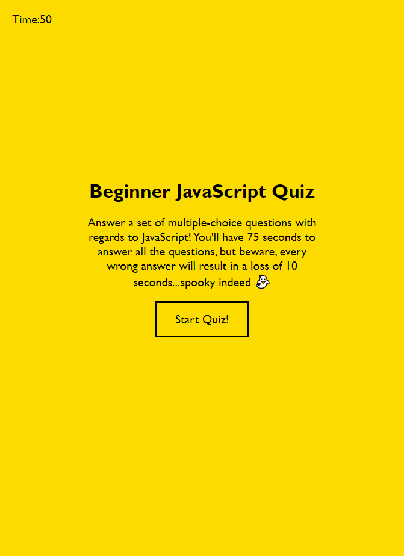

# JavaScript Quiz (still in development)

## Description

Build a quiz made up of several multiple choice questions using HTML, CSS, and JavaScript. The final product should allow you to press a 'Start Button' on the landing page to begin the quiz and allow you to cycle through as you respond to each question. Pressing the 'Start Button' will also start a timer which counts down from 75 seconds. The quiz ends when all the questions are answered or when the timer runs out. 

## Overview of Work Done

* Webpage built using HTML and styled using CSS

* Title page, quiz description, and functional 'Start Button' aligned centrally towards the top of the page.

* 'Start Button' clears the landing page and starts the quiz with the first question.

* 'High Scores' button in the top left, however it does not yet load the scores.

* Quiz is yet to be completed. So far the first question shows, however the subsequent questions cannot yet be cycled through, nor does the timer begin.

## Webpage

Link: https://stricker2.github.io/javascript-quiz/

## Contributors

This project has been produced and worked solely by Andrew Secore